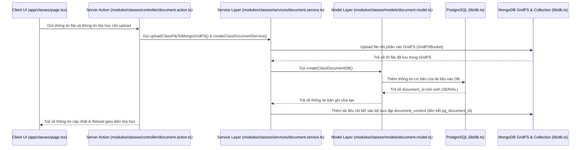
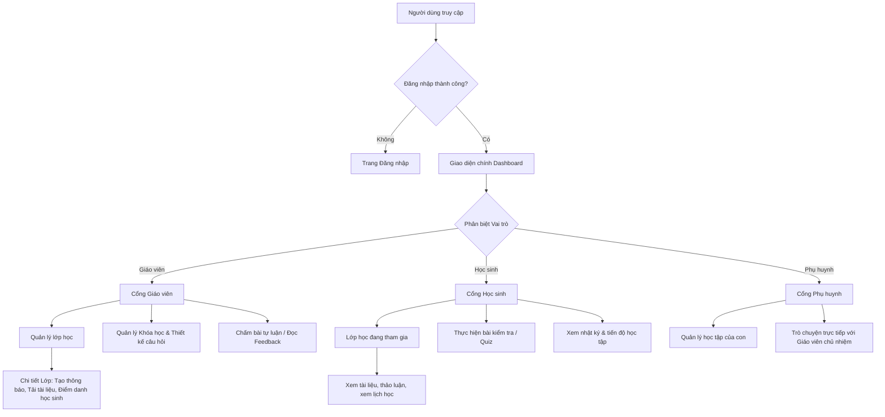

# Kiến Trúc và Cấu Trúc Dự Án SelfMOOC

Tài liệu này mô tả chi tiết về cấu trúc phân cấp thư mục, mô hình kiến trúc cơ sở dữ liệu kết hợp (Hybrid DB), thiết kế phân lớp nghiệp vụ (Modular Design) và luồng dữ liệu của hệ thống **SelfMOOC**.

---

## 1. Sơ đồ Cấu trúc Phân cấp Thư mục (Project Directory Tree)

Dưới đây là sơ đồ hình cây của toàn bộ dự án từ thư mục gốc:

```text
d:\SelfMOOC
├── Relation.sql               # Định nghĩa Schema PostgreSQL (Bảng, Chỉ mục, Trigger)
├── NoSql.js                   # Định nghĩa Validators & Chỉ mục cho MongoDB (Collections)
├── README.md                  # Hướng dẫn chung của Repository
├── project_structure.md       # Tài liệu cấu trúc dự án này
└── selfmooc/                  # Thư mục ứng dụng Next.js chính
    ├── .env.local             # Biến môi trường local (DATABASE_URL, MONGODB_URI...)
    ├── tsconfig.json          # Cấu hình TypeScript
    ├── package.json           # Các thư viện phụ thuộc (Next 16, React 19, Socket.io, pg, MongoDB...)
    ├── socket-server.js       # Server Socket.io riêng cho các tính năng realtime (chat)
    ├── app/                   # Next.js App Router (Giao diện & Định tuyến)
    │   ├── layout.tsx         # Layout gốc (Root Layout)
    │   ├── globals.css        # Định nghĩa CSS toàn cục (Tailwind CSS v4 config)
    │   ├── login/             # Trang đăng nhập hệ thống
    │   ├── api/               # Các REST API endpoints
    │   │   └── files/         # API quản lý file thông qua MongoDB GridFS
    │   │       └── [fileId]/
    │   │           └── route.ts
    │   ├── components/        # Các UI Components dùng chung
    │   │   ├── ui/            # UI components cơ bản (Button, Input, Badge...)
    │   │   └── layout/        # Các thành phần giao diện lớn (Sidebar, Navbar...)
    │   └── (dashboard)/       # Group Router Dashboard sau khi đăng nhập
    │       ├── page.tsx       # Trang chính dashboard
    │       ├── layout.tsx     # Layout dashboard với Sidebar và Main Area
    │       ├── assignments/   # Quản lý Bài tập / Bài kiểm tra
    │       ├── chats/         # Phòng chat realtime (Giáo viên - Phụ huynh)
    │       ├── classes/       # Lớp học (Danh sách học sinh, điểm danh...)
    │       ├── courses/       # Khóa học, ngân hàng câu hỏi, tài liệu
    │       ├── diary/         # Nhật ký học tập của học sinh
    │       ├── family/        # Liên kết và quản lý quan hệ gia đình
    │       ├── grading/       # Chấm điểm và tổng hợp kết quả học tập
    │       ├── profile/       # Thông tin cá nhân của người dùng
    │       └── schedule/      # Xem và quản lý thời khóa biểu
    │
    ├── lib/                   # Thư mục chứa cấu hình và tiện ích dùng chung
    │   ├── db.ts              # Khởi tạo kết nối PostgreSQL (Neon) & MongoDB (Atlas)
    │   └── mail.ts            # Cấu hình gửi mail (Nodemailer)
    │
    └── modules/               # Tầng xử lý Logic Nghiệp vụ Phân lớp (Domain-Driven Modules)
        ├── announcements/     # Quản lý bảng tin và thông báo lớp học
        ├── assignments/       # Quản lý bài tập, bài làm và chấm điểm chi tiết
        ├── auth/              # Xác thực và phân quyền tài khoản (Teacher, Student, Parent)
        ├── chats/             # Quản lý phòng chat và tin nhắn
        ├── classes/           # Quản lý lớp học, học sinh, điểm danh
        │   ├── controller/    # Tầng Server Actions (class.action.ts, schedule.action.ts...)
        │   ├── services/      # Tầng Logic nghiệp vụ (document.service.ts, schedule.service.ts...)
        │   └── models/        # Tầng thao tác CSDL (class.model.ts, document.model.ts...)
        ├── courses/           # Quản lý khóa học, ngân hàng câu hỏi chung
        ├── family/            # Liên kết tài khoản Phụ huynh - Học sinh
        ├── notifications/     # Hệ thống gửi nhận thông báo in-app / email
        └── profile/           # Cập nhật và xem thông tin cá nhân
```

---

## 2. Kiến Trúc Dữ Liệu Lai (Hybrid Database Architecture)

Hệ thống kết hợp sức mạnh của cả SQL và NoSQL để tối ưu hóa hiệu năng và độ linh hoạt:
- **PostgreSQL (Quan hệ)**: Quản lý tính toàn vẹn dữ liệu cho định danh (tài khoản, mối quan hệ gia đình), cấu trúc khóa học, đăng ký lớp học, quản lý thời khóa biểu và điểm số tổng kết.
- **MongoDB (Tài liệu)**: Lưu trữ các nội dung phi cấu trúc hoặc thường xuyên thay đổi như chi tiết câu hỏi (nhiều lựa chọn, điền ô trống, tự luận...), bài làm chi tiết của học sinh (submission content), lịch sử hoạt động học tập (activity logs), tin nhắn thời gian thực và thông báo (notification).

---

## 3. Cấu Trúc Luồng Nghiệp Vụ Trong Mỗi Module

Mỗi thư mục con trong `modules/` được chia thành cấu trúc 3 lớp rõ rệt:

1. **Model Layer (`models/`)**: 
   Chứa các câu truy vấn cơ sở dữ liệu thô (SQL thô cho PostgreSQL hoặc Queries cho MongoDB). 
   *File ví dụ:* `modules/classes/models/class.model.ts`
2. **Service Layer (`services/`)**: 
   Chứa logic nghiệp vụ cốt lõi, xác thực điều kiện đầu vào, thực hiện tính toán và điều phối dữ liệu giữa các model hoặc dịch vụ khác. 
   *File ví dụ:* `modules/classes/services/document.service.ts`
3. **Controller/Action Layer (`controller/`)**: 
   Định nghĩa các **Next.js Server Actions** (`"use server"`). Nhận đầu vào từ UI Components, gọi đến Service tương ứng và trả về kết quả cho Client. 
   *File ví dụ:* `modules/classes/controller/class.action.ts`

---

## 4. Sơ đồ Luồng Hoạt Động (Sequence Diagram)

Dưới đây là sơ đồ luồng dữ liệu minh họa cho hành động **Tải lên học liệu của Lớp học** (Giáo viên tải file lên hệ thống).

### Mã vẽ sơ đồ (Mermaid Code)
Bạn có thể copy mã này để vẽ trên các trang hỗ trợ Mermaid (ví dụ: [mermaid.live](https://mermaid.live)):



---

## 5. Cấu Trúc Phân Cấp Giao Diện (UI/UX Hierarchy & Flow)

Hệ thống SelfMOOC thiết kế giao diện theo mô hình **Dashboard trung tâm**, sử dụng layout dạng lưới hiện đại với các luồng định hướng linh hoạt dựa trên vai trò (Role-based UI/UX).

### 5.1. Khung Giao Diện Chính (Shell Layout)
Mọi trang nằm trong thư mục `app/(dashboard)/` đều thừa hưởng khung cấu trúc từ [layout.tsx](file:///d:/SelfMOOC/selfmooc/app/(dashboard)/layout.tsx):
- **Thanh điều hướng bên (Sidebar.tsx)**: Nằm ở mép trái, chứa logo hệ thống và các liên kết nhanh phân theo nghiệp vụ (Lớp học, Khóa học, Điểm danh, Lịch học, Chat...).
- **Thanh tiêu đề (Header.tsx)**: Nằm ở phía trên cùng, chứa ô tìm kiếm toàn cục, nút bật/tắt thông báo in-app (realtime qua Socket.io) và khu vực avatar người dùng (Profile / Đăng xuất).
- **Vùng hiển thị nội dung chính (Main Canvas)**: Khu vực trung tâm hiển thị các trang nghiệp vụ chi tiết.

---

### 5.2. Sơ đồ Định Tuyến & Cấu Trúc Trang Phân Quyền (Role-based Routes)

Ứng dụng tự động kiểm tra vai trò người dùng (**Teacher / Student / Parent**) từ server-side session để render giao diện phù hợp. Sơ đồ dưới đây thể hiện cấu trúc phân cấp UI:

```text
Giao diện Hệ thống
├── [Đăng nhập] (app/login/page.tsx)
└── [Dashboard Chính] (app/(dashboard)/layout.tsx)
    ├── Bảng điều khiển tổng quan (page.tsx)
    │
    ├── Phân hệ Lớp học (classes/)
    │   ├── Trang chủ danh sách lớp (page.tsx)
    │   │   ├── Nếu là Giáo viên → TeacherClassesPage.tsx (Xem/tạo lớp mới)
    │   │   └── Nếu là Học sinh → StudentClassesPage.tsx (Xem/tham gia lớp học qua code)
    │   │
    │   └── Chi tiết lớp học (classes/[classId]/page.tsx)
    │       ├── Nếu là Giáo viên → TeacherClassDetailPage.tsx (Quản lý)
    │       └── Nếu là Học sinh → StudentClassDetailPage.tsx (Học tập)
    │       │
    │       └── Các Tab Nghiệp vụ Con (classes/[classId]/tabs/)
    │           ├── Bảng tin & Thảo luận (ClassAnnouncementTab.tsx)
    │           ├── Học liệu & File đính kèm (ClassMaterialsTab.tsx)
    │           ├── Quản lý kiểm tra & Quizzes (ClassQuizzesTab.tsx)
    │           ├── Lịch học lớp học (ClassScheduleTab.tsx)
    │           ├── Danh sách thành viên lớp (ClassStudentTab.tsx)
    │           └── Điểm danh (ClassAttendanceTab.tsx)
    │
    ├── Phân hệ Khóa học (courses/)
    │   ├── Danh sách khóa học & Ngân hàng câu hỏi (page.tsx)
    │   └── Chi tiết khóa học & Quản trị bài giảng (courses/[courseId]/page.tsx)
    │
    ├── Phân hệ Bài tập & Làm bài (assignments/)
    │   └── Trang chi tiết & Làm bài kiểm tra (assignments/[assignmentId]/page.tsx)
    │
    ├── Phân hệ Chấm điểm (grading/)
    │   ├── Danh sách các bài làm cần chấm (page.tsx)
    │   └── Studio chấm bài & Cho điểm tự luận (grading/[submissionId]/page.tsx)
    │
    ├── Phân hệ Tin nhắn Realtime (chats/)
    │   └── Khung chat chia đôi (layout.tsx)
    │       ├── Sidebar danh sách cuộc trò chuyện (Teacher ↔ Parent)
    │       └── Khung hiển thị nội dung tin nhắn hoạt động qua Socket.io (chats/[contactId]/page.tsx)
    │
    └── Phân hệ Khác
        ├── Lịch học cá nhân (schedule/page.tsx)
        ├── Liên kết Phụ huynh - Học sinh (family/page.tsx)
        ├── Nhật ký tiến độ học tập (diary/page.tsx)
        └── Cài đặt thông tin cá nhân (profile/page.tsx)
```

---

### 5.3. Sơ đồ Luồng Điều Hướng UI (UX Navigation Flow)

Dưới đây là mã Mermaid mô tả luồng di chuyển của các đối tượng người dùng qua các giao diện:


